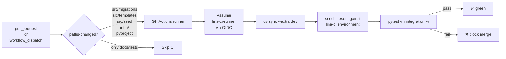

# LINA — CI Real-Backend Integration Tests (v1.2.0) Design

**Status:** Approved for planning
**Date:** 2026-05-03
**Source:** Direct follow-up to v1.1.0 (sandbox deployment). Five real-Redshift dialect bugs surfaced during the v1.1.0 sandbox bring-up (`6c2d634`, `0c10f35`, `1a9bad6`, `3cf419b`, `84e311c`). All would have been caught earlier by automated integration tests against real Redshift + OpenSearch — they weren't, because the integration suite was only designed to run manually with operator-supplied env vars.
**Scope:** Add a CI workflow that runs the full integration suite (`pytest -m integration`) against real AWS resources on every pull request that touches affected paths.

---

## 1. Goal

After this milestone:

- Every PR that touches `src/lina_redshift/migrations/sql/`, `src/lina_*/templates/`, `src/lina_*/seed/`, `infra/tofu/`, `pyproject.toml`, or `uv.lock` automatically triggers a CI workflow that:
  1. Stands up (or refreshes) a small dedicated `lina-ci` AWS environment (Redshift Serverless workgroup + OpenSearch domain + auxiliary resources).
  2. Applies migrations + seeds against it.
  3. Runs the 18 staged integration tests.
  4. Tears down ephemeral test artifacts; persistent test backends stay up between runs.
  5. Reports pass/fail to GitHub.
- A red CI run blocks merge.
- The CI account uses **OIDC** (no long-lived AWS access keys committed to GitHub Secrets).

---

## 2. Architectural Decisions (Locked)

| # | Decision | Choice | Notes |
|---|---|---|---|
| 1 | Backend lifecycle | **Persistent shared `lina-ci` environment** (one workgroup, one domain) reused across CI runs; tests do their own `seed --reset` for isolation | Cost ~$30/month idle. Faster than ephemeral (~5 min CI vs ~25 min). Trade-off: data races between concurrent runs handled via per-run namespacing in seeds; see §6. |
| 2 | Authentication | GitHub Actions → AWS via **OIDC** (`token.actions.githubusercontent.com` → IAM role `lina-ci-runner`); no static keys | Industry-standard for GitHub→AWS in 2026 |
| 3 | Trigger | `pull_request` events on the listed paths + manual `workflow_dispatch` | No nightly scheduled runs in v1.2; opt-in via dispatch when needed |
| 4 | Concurrency | One CI run at a time per branch (`concurrency` group keyed on PR number) | Avoids racing seed truncates and migration applies |
| 5 | Test command | `uv run pytest -m integration` with all 4 env-var sets exported | Reuses existing skip behavior — anything not env-bound stays skipped |
| 6 | OpenAI key handling in CI | Same Secrets Manager secret `lina/sandbox/openai-api-key` reused; CI role granted read on that ARN | Cassettes are sufficient for the supervisor smoke tests; CI does NOT call the live OpenAI API |
| 7 | Cost ceiling | AWS Budget alarm at $50/month tied to `Environment=ci` tag; auto-shutdown Lambda fires at $40 | CI can't out-run the sandbox cost regardless of PR volume |
| 8 | Tear-down | Workgroup auto-pauses; OpenSearch stays up. **No `tofu destroy` per run**; only on milestone version bumps. | Manual `tofu -chdir=infra/tofu/ci destroy` available for cleanup |
| 9 | Test environment IaC | New module `infra/tofu/ci/` separate from `infra/tofu/` (sandbox), shares the same provider config patterns | Keeps sandbox + CI environments truly isolated; either can be destroyed without affecting the other |
| 10 | State storage | S3 backend for both `infra/tofu/` and `infra/tofu/ci/` with DynamoDB lock | Multiple operators / CI runners need shared state |

---

## 3. Repository Additions

```text
lina/
├── .github/
│   └── workflows/
│       ├── ci-integration.yml           # NEW — main integration workflow
│       └── ci-cost-watcher.yml          # NEW — daily cron checks $40/$50 budget
├── infra/
│   └── tofu/
│       ├── (existing sandbox)           # unchanged
│       ├── bootstrap/                   # NEW — one-time S3 + DynamoDB for state
│       │   ├── main.tf
│       │   └── outputs.tf
│       ├── shared/                      # NEW — OIDC provider + IAM role for GH Actions
│       │   ├── main.tf
│       │   ├── oidc.tf
│       │   └── outputs.tf
│       └── ci/                          # NEW — the test backend itself
│           ├── main.tf
│           ├── redshift.tf
│           ├── opensearch.tf
│           ├── outputs.tf
│           └── README.md
├── deploy/
│   └── ci-runbook.md                    # NEW — operator setup steps for first time
└── docs/superpowers/
    ├── specs/2026-05-03-lina-ci-integration-tests-design.md  # this doc
    └── plans/2026-05-03-lina-ci-integration-tests.md         # NEW
```

---

## 4. CI Workflow Topology



The runner is a stock `ubuntu-latest` GitHub-hosted machine. Provisioning of `lina-ci` Redshift + OpenSearch happens out-of-band (one-time `tofu apply` by an operator); the CI workflow does NOT run `tofu apply` per build.

---

## 5. IAM / OIDC

### 5.1 OIDC trust

```hcl
# infra/tofu/shared/oidc.tf
resource "aws_iam_openid_connect_provider" "github" {
  url             = "https://token.actions.githubusercontent.com"
  client_id_list  = ["sts.amazonaws.com"]
  thumbprint_list = ["6938fd4d98bab03faadb97b34396831e3780aea1"]
}

resource "aws_iam_role" "ci_runner" {
  name = "lina-ci-runner"
  assume_role_policy = jsonencode({
    Version = "2012-10-17"
    Statement = [{
      Effect = "Allow"
      Principal = { Federated = aws_iam_openid_connect_provider.github.arn }
      Action = "sts:AssumeRoleWithWebIdentity"
      Condition = {
        StringEquals = {
          "token.actions.githubusercontent.com:aud" = "sts.amazonaws.com"
        }
        StringLike = {
          "token.actions.githubusercontent.com:sub" = "repo:koosha/lina:*"
        }
      }
    }]
  })
}
```

The condition restricts the role to GitHub Actions runs from `koosha/lina` (any branch / PR / tag). Tighten further later by pinning to specific environments.

### 5.2 Role permissions

`lina-ci-runner` gets:
- Redshift Serverless: `redshift-serverless:GetWorkgroup`, query connection through driver
- Secrets Manager: `secretsmanager:GetSecretValue` on `lina/ci/redshift-admin`, `lina/sandbox/openai-api-key`
- OpenSearch: `es:ESHttp*` on the `lina-ci` domain ARN
- CloudWatch: write to `/aws/ci/lina/*` log group (for run logs)
- ECR: read on `lina-chat-sandbox` (in case integration test reuses container images later)

All scoped to specific resource ARNs — no `*` resources except where AWS requires (e.g., `redshift-serverless:GetCredentials` with `Resource: *` because the API doesn't accept resource scoping there).

---

## 6. Test Data Lifecycle

The biggest CI design decision: how to keep parallel CI runs from corrupting each other's test data.

**Choice: each CI run does `seed --reset` before running tests.** The `--reset` flag truncates all dimension/fact tables and reloads from the deterministic seed. Single CI run at a time per PR (per `concurrency` setting) means there's no concurrent reset.

**Single concurrent run constraint.** If two PRs land minutes apart, the second waits for the first via GitHub Actions concurrency groups. ~5 min per run × queued PRs is acceptable for v1.2; if it becomes a bottleneck, switch to **per-PR namespaced indices/tables** in v1.3.

**OpenSearch domain isolation:** the same `lina-ci` domain hosts indices `corp_user_profiles_v1` and `vendor_lawyer_profiles_v1`. The CI workflow does `indices apply && seed --reset` before each run.

**Cassette refresh:** supervisor cassettes (`tests/integration/lina_supervisor/cassettes/`) ARE committed to the repo — they replay deterministically without an OpenAI key. CI does not record cassettes; only replays. A separate manual workflow (`workflow_dispatch`) regenerates cassettes when the supervisor's prompt or tool catalog changes.

---

## 7. The Workflow File (Sketch)

```yaml
# .github/workflows/ci-integration.yml
name: integration-tests

on:
  pull_request:
    paths:
      - 'src/lina_redshift/migrations/sql/**'
      - 'src/lina_*/templates/**'
      - 'src/lina_*/seed/**'
      - 'src/lina_*/worker.py'
      - 'src/lina_supervisor/**'
      - 'tests/integration/**'
      - 'infra/tofu/**'
      - 'pyproject.toml'
      - 'uv.lock'
  workflow_dispatch:

permissions:
  id-token: write
  contents: read

concurrency:
  group: integration-${{ github.head_ref || github.ref }}
  cancel-in-progress: false

jobs:
  integration:
    runs-on: ubuntu-latest
    timeout-minutes: 30
    steps:
      - uses: actions/checkout@v4

      - uses: aws-actions/configure-aws-credentials@v4
        with:
          role-to-assume: arn:aws:iam::417811547857:role/lina-ci-runner
          aws-region: us-east-1

      - uses: astral-sh/setup-uv@v3
        with: { version: '0.8.13' }

      - run: uv sync --extra dev

      - name: Resolve env vars from outputs / secrets
        run: |
          echo "LINA_REDSHIFT_DSN=$(./scripts/ci-redshift-dsn.sh)" >> $GITHUB_ENV
          echo "LINA_OPENSEARCH_HOST=$(./scripts/ci-opensearch-host.sh)" >> $GITHUB_ENV
          echo "LINA_OPENSEARCH_AUTH=aws_sigv4" >> $GITHUB_ENV
          echo "LINA_AWS_REGION=us-east-1" >> $GITHUB_ENV

      - name: Reset + seed CI environment
        run: |
          uv run lina-redshift --target redshift migrate up
          uv run lina-redshift --target redshift seed --reset
          uv run lina-users indices apply
          uv run lina-users seed --reset
          uv run lina-vendors indices apply
          uv run lina-vendors seed --reset

      - name: Run integration suite
        run: uv run pytest -m integration -v --tb=short

      - name: Run unit suite (sanity)
        run: uv run pytest -m unit -q
```

`./scripts/ci-redshift-dsn.sh` is a small shell script that pulls the workgroup endpoint via `aws redshift-serverless get-workgroup` and the password via `aws secretsmanager get-secret-value`, then assembles the DSN. Same pattern for OpenSearch host.

---

## 8. Cost & Cleanup

| Item | Cost | Notes |
|---|---|---|
| `lina-ci` OpenSearch domain (t3.small, 1 node) | ~$26/month idle | The dominant line item |
| `lina-ci` Redshift Serverless (auto-paused) | ~$0/month idle, ~$0.10 per CI run active | 8 RPU base × seconds-per-run |
| Secrets Manager (3 secrets shared with sandbox) | $1.20/month | |
| CloudWatch logs (CI logs) | ~$1/month at PR cadence | 1 week retention |
| GitHub Actions minutes | $0 (free for public repos; private repos get 2,000 free minutes/month and ours fits comfortably) | |
| **Total at idle** | **~$28/month** | |
| **Per-CI-run cost** | **~$0.10** | Mostly Redshift active seconds + OpenAI tokens (only via supervisor cassettes, which are free) |

Budget alarms at $40 (warning) and $50 (auto-pause). The cost watcher (`ci-cost-watcher.yml`) runs daily and tags any anomaly over $5 in 24h, signaling a runaway misconfiguration.

---

## 9. Pre-existing State (What Carries Over)

The v1.1.0 sandbox provisioned `infra/tofu/` with **local OpenTofu state**. Migrating to S3-backed remote state is a bootstrap step in this milestone (Task 1 of the plan). The migration is non-destructive: `tofu state push` carries the existing state into the new backend without re-creating any resources.

The existing v1.1.0 sandbox infrastructure stays in place; this milestone adds *additional* infrastructure (the `lina-ci` environment and the GitHub OIDC trust). The two are isolated.

---

## 10. Out of Scope (Deferred)

- **Per-PR namespaced isolation** (each PR gets its own ephemeral schema in Redshift + index suffix in OpenSearch) — v1.3+
- **Recording supervisor cassettes in CI** (would require OpenAI API key in GitHub Secrets and live API costs) — manual via `workflow_dispatch` only
- **Multi-region failover for CI** — single region (us-east-1) only
- **Performance/load tests** — CI runs functional tests; perf testing is separate
- **Custom GitHub Actions self-hosted runners** — using GitHub-hosted runners only
- **Slack/PagerDuty integration** — CI failure notifications via standard GitHub email/webhook only
- **Required-status-check enforcement** — set up by you in GitHub branch protection settings; not automatable from this repo

---

## 11. Success Criteria

This milestone is complete when:

- A PR that breaks any of the 5 v1.1.0 dialect bugs (e.g., reverting `6c2d634`) **fails CI** before merge.
- A PR that touches only docs (no `src/`, no `infra/`) **does not** trigger CI (path filters work).
- The OIDC trust is confirmed working — no static AWS keys exist in GitHub Secrets for this repo.
- `infra/tofu/` and `infra/tofu/ci/` both use S3-backed remote state with DynamoDB lock; `tofu state list` shows the same resources as before the migration (no recreates).
- `deploy/ci-runbook.md` documents the one-time bootstrap steps so a new operator can stand up the CI infra from scratch in ≤ 30 minutes.
- README's "Sandbox deployment" section gains a sibling "CI" section linking to the runbook.
- Tagged as `v1.2.0` with annotation `LINA v1.2.0 — real-backend integration tests in CI`.
